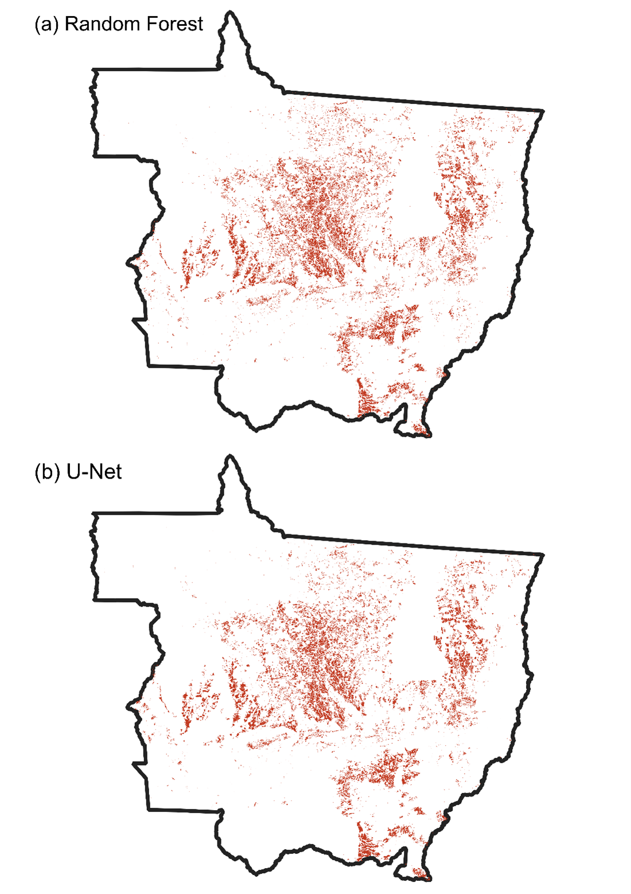
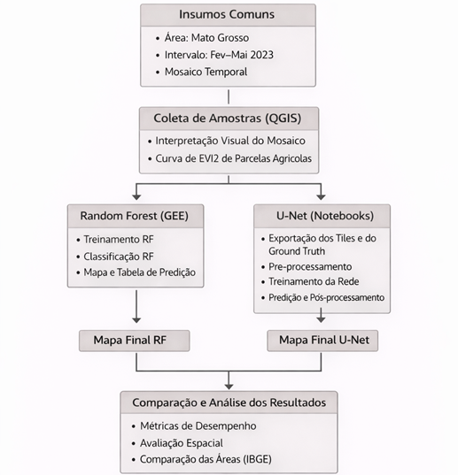
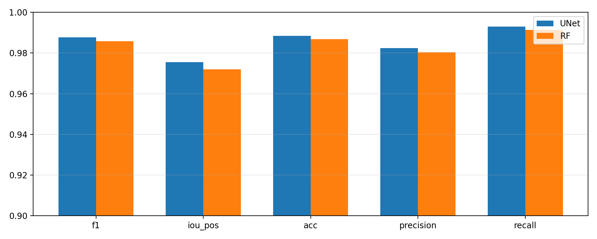
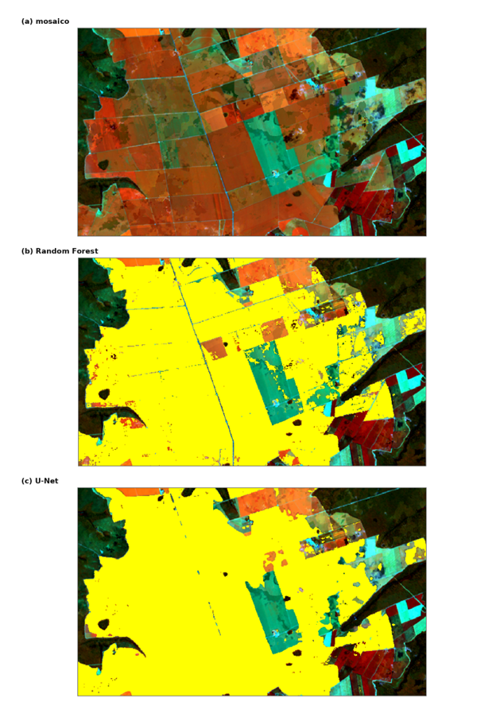
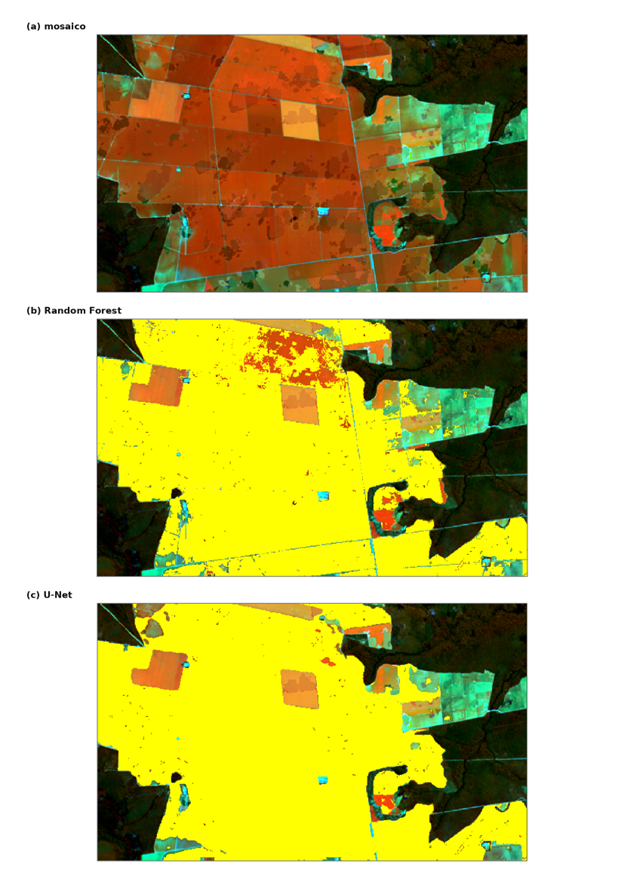
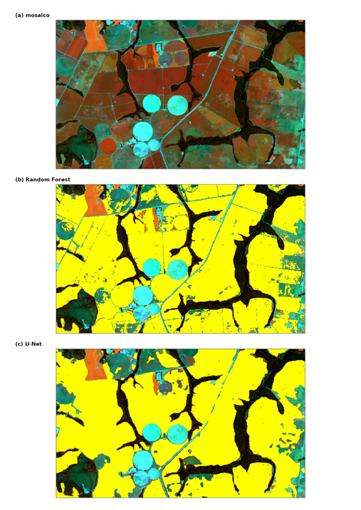

# Milho Safrinha RF vs U-Net (MT 2023)

Comparação reprodutível entre um baseline Random Forest no Google Earth Engine e uma U-Net treinada com exportações do GEE para mapear milho safrinha em Mato Grosso.



## Visão geral

Este repositório organiza um experimento comparativo de mapeamento de milho safrinha em `MT` no ciclo de `2023-02-01` a `2023-05-31`, mantendo o fluxo operacional original do projeto.

- RF no GEE como baseline robusto e mais simples de operar.
- U-Net com exportações do GEE, geração de shards, treino, validação, predição e pós-processamento em notebooks.
- Mesma área de estudo, mesma janela temporal e mesma máscara agrícola para sustentar uma comparação controlada.
- Detalhes complementares em [docs/visao_geral.md](docs/visao_geral.md) e [docs/referencias_dados.md](docs/referencias_dados.md).

## Pergunta que o projeto responde

> Com os mesmos insumos Landsat 8/9 + EVI2 + máscara agrícola MapBiomas C10, quanto uma U-Net melhora o mapeamento de milho safrinha em MT 2023 em relação a um Random Forest executado integralmente no GEE?

## Resultados em destaque

- Comparação controlada entre RF e U-Net em `MT 2023`, com avaliação pixel a pixel em `VAL_FINAL` e alinhamento espacial na mesma referência.
- Insumos comuns às duas abordagens: Landsat `8/9 C2 L2`, `EVI2` e máscara agrícola `MapBiomas C10`.
- A U-Net teve vantagem consistente nas métricas versionadas e também aparece com melhor coerência espacial nos mapas e recortes do showcase.
- O RF permaneceu como baseline forte para comparação, com menor complexidade operacional e execução direta no GEE.
- O material de análise do projeto registra subestimação de área frente ao IBGE, mas mantendo consistência entre os dois modelos.

| Modelo | Precisão | Revocação | F1 | IoU | Acurácia |
| --- | ---: | ---: | ---: | ---: | ---: |
| U-Net | 0.9823 | 0.9930 | 0.9876 | 0.9755 | 0.9884 |
| RF | 0.9804 | 0.9913 | 0.9858 | 0.9720 | 0.9867 |

- Área estimada na comparação alinhada em `EPSG:5880`: U-Net `~6,14 Mha` e RF `~6,27 Mha`.
- Evidências versionadas: [table_metrics_valfinal_unet_vs_rf.csv](results/comparisons/table_metrics_valfinal_unet_vs_rf.csv), [resultados_valfinal_unet_vs_rf.md](results/comparisons/resultados_valfinal_unet_vs_rf.md) e [area_and_agreement_unet_vs_rf_on_unetgrid.json](results/comparisons/area_and_agreement_unet_vs_rf_on_unetgrid.json).

## Showcase visual

### Fluxo metodológico



### Métricas



### Comparação espacial estadual


### Recorte local 1



### Recorte local 2



### Recorte local 3



## Dados utilizados

- Área de estudo: Mato Grosso (`SIGLA_UF = "MT"`), a partir do asset `projects/ee-rafaelparanhos/assets/UF`.
- Período do mosaico e da comparação: `2023-02-01` a `2023-05-31`.

| Fonte | Papel no projeto |
| --- | --- |
| `LANDSAT/LC08/C02/T1_L2` e `LANDSAT/LC09/C02/T1_L2` | Base espectral do mosaico 2023 para RF e U-Net |
| `EVI2` | Índice espectral usado como parte dos preditores |
| `projects/mapbiomas-public/assets/brazil/lulc/collection10/mapbiomas_brazil_collection10_coverage_v2` | Máscara agrícola C10 |
| `projects/ee-rafaelparanhos/assets/SAMPLES_FINAL` | Amostras de treino do RF |
| `projects/ee-rafaelparanhos/assets/VAL_FINAL` | Base de validação comparativa |
| `projects/ee-rafaelparanhos/assets/UF` | Limite estadual |

## Comparação entre as abordagens

| Aspecto | RF no GEE | U-Net com GEE + notebooks |
| --- | --- | --- |
| Execução | Treino e inferência no próprio GEE | Exporta mosaico/C10 e GTv2 no GEE; treina, valida, prediz e pós-processa em notebooks |
| Papel no projeto | Baseline robusto e simples operacionalmente | Abordagem de maior desempenho no experimento |
| Força principal | Fluxo direto, menor atrito operacional | Vantagem consistente nas métricas e melhor coerência espacial |
| Trade-off | Menor flexibilidade para modelagem espacial fina | Mais etapas e mais artefatos para controlar |
| Saídas centrais | Mapas RF e tabelas `rf_*Pred_mt_2023_c10.csv` | Tiles, shards, checkpoints e mapa final pós-processado |

## Estrutura do repositório

```text
gee/
  rf/
    export_c10_mask_mt_2023.js
    rf_mt_2023_c10.js
  unet/
    export_unet_mosaic_c10_mt_2023.js
    export_unet_gtv2_mt_2023.js

notebooks/
  unet/
  qa/
  analysis/
  archive/

docs/
  showcase/
  visao_geral.md
  referencias_dados.md

results/
  metrics/
  comparisons/
```

- `notebooks/analysis/` permanece como camada complementar de comparação e análise.
- `notebooks/archive/` permanece como material legado para rastreabilidade.

## Fluxo principal

1. `gee/rf/export_c10_mask_mt_2023.js`
2. `gee/rf/rf_mt_2023_c10.js`
3. `gee/unet/export_unet_mosaic_c10_mt_2023.js`
4. `gee/unet/export_unet_gtv2_mt_2023.js`
5. `notebooks/unet/01_unet_preprocess_shards.ipynb`
6. `notebooks/unet/02_unet_train_run1.ipynb`
7. `notebooks/unet/03_unet_validation_run1.ipynb`
8. `notebooks/unet/04_unet_predict_mt.ipynb`
9. `notebooks/unet/05_unet_postprocess_c10.ipynb`

## Principais saídas

- RF:
  `rf_milho_mt_2023_c10.tif`, `rf_milho_mask1_mt_2023_c10.tif`, `rf_*Pred_mt_2023_c10.csv`
- U-Net:
  `unet_mt_2023_mosaic_x*_y*.tif`, `unet_mt_2023_c10mask_x*_y*.tif`, `unet_mt_2023_gtv2_x*_y*.tif`, `best.pt`, `last.pt`, `unet_mt2023_pred_c10.tif`
- Resultados versionados:
  [results/metrics/](results/metrics/), [results/comparisons/](results/comparisons/)

## Reprodutibilidade

- A lógica do projeto permanece a mesma: rode os scripts GEE e os notebooks na ordem listada em **Fluxo principal**.
- O run canônico da U-Net é `unet_mt2023_v2_run1`, com checkpoints `best.pt` e `last.pt`.
- O conjunto documentado para a U-Net registra `94` shards de treino, `19` de validação e `19` de teste, totalizando `3000/600/600` patches em [patch_stats.json](results/metrics/patch_stats.json).
- As métricas do teste da U-Net estão em [test_metrics.json](results/metrics/test_metrics.json).
- A comparação final entre U-Net e RF está consolidada em [results/comparisons/](results/comparisons/).

## Post público sobre o projeto

Há uma publicação externa que resume o contexto, o fluxo comparativo e o posicionamento do projeto em formato mais curto.
Ela funciona como uma camada pública de apresentação, enquanto este repositório concentra os artefatos técnicos e a reprodutibilidade.

[Ver publicação no LinkedIn](https://www.linkedin.com/feed/update/urn:li:activity:7440004304092086273/?originTrackingId=275ulkavzYGFzjt6Qp4ypA%3D%3D)

## Limitações

- O escopo atual é um recorte único: `MT 2023`.
- A comparação representa um fluxo canônico de RF e um fluxo canônico de U-Net, não uma busca exaustiva de hiperparâmetros.
- A referência ao IBGE aparece como leitura do projeto, mas não está consolidada em tabela própria dentro de `results/`.

## Próximos passos

- Expandir a mesma comparação para novos recortes temporais ou geográficos.
- Empacotar o fluxo em uma camada operacional mais direta, sem perder a rastreabilidade dos artefatos atuais.

## Autor

Rafael Paranhos

Projeto de portfólio técnico em sensoriamento remoto, Google Earth Engine e deep learning aplicado ao mapeamento agrícola.
